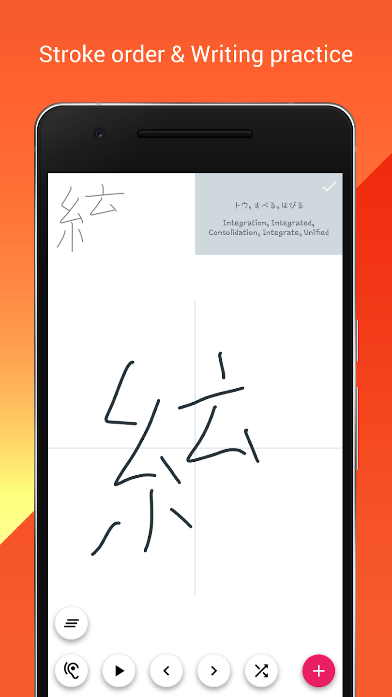
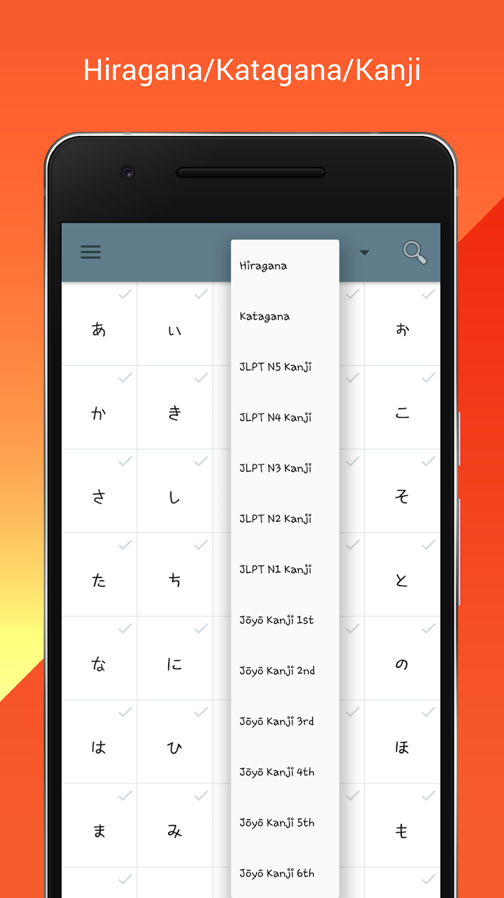

# Handwriting japanese

## Environment
- Android Studio Electric Eel | 2022.1.1 Patch 2
- Lombok bundled 221.5080.210
- JDK11
- AGP 7.4.2 / Gradle 7.5.1
- compileSdkVersion 34 / minSdkVersion 23 / targetSdkVersion 34

## Screen shot

